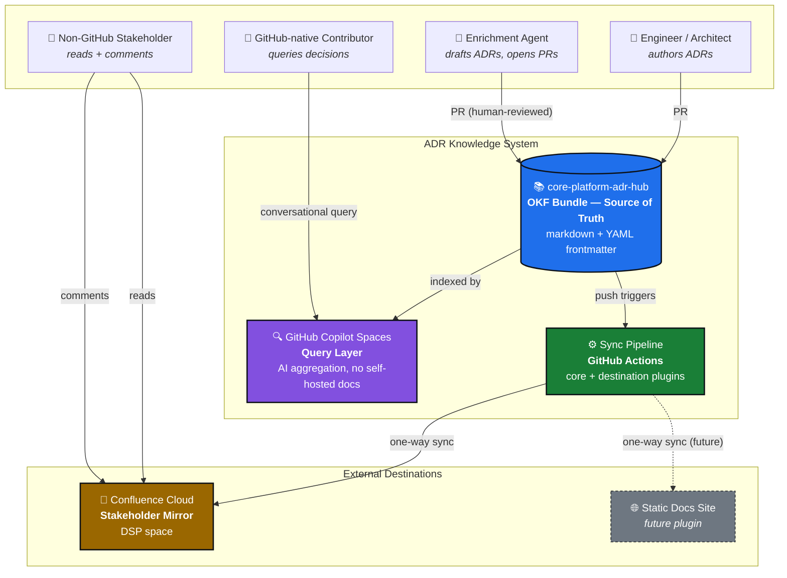
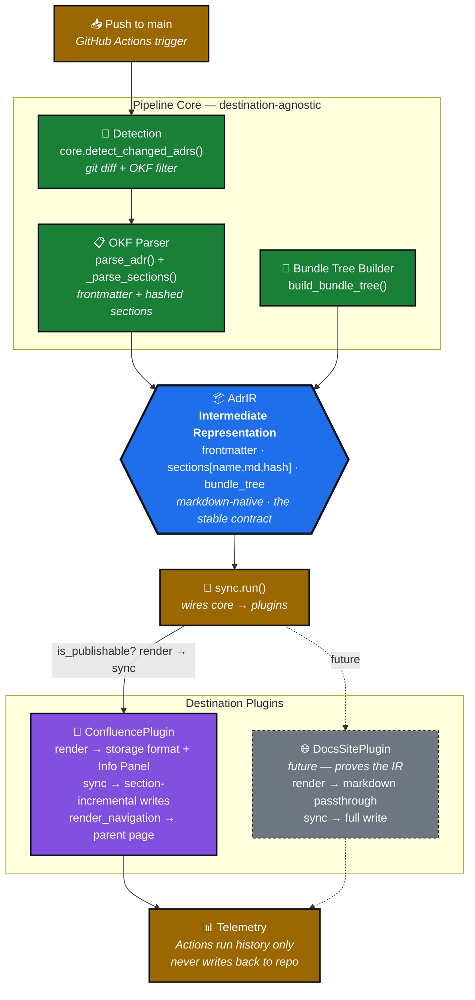
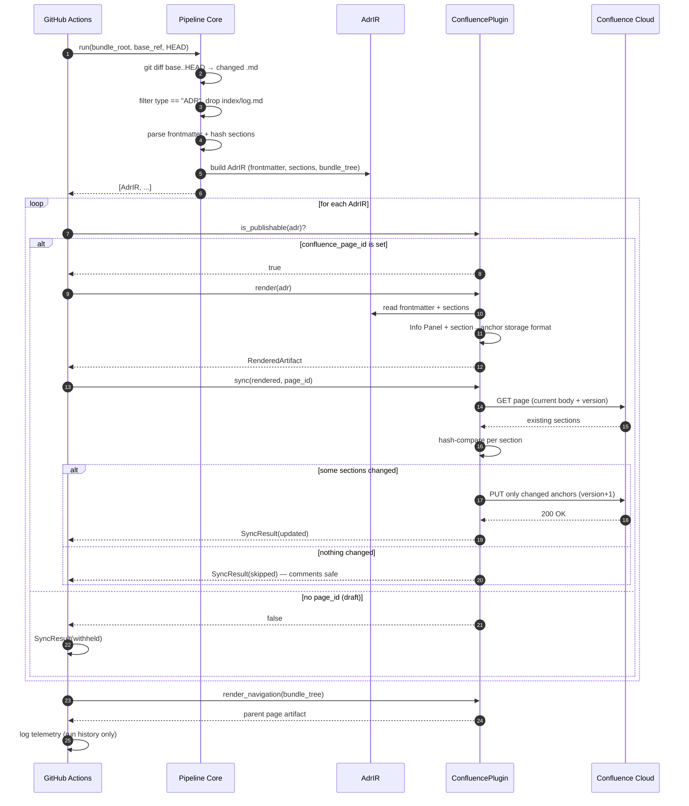
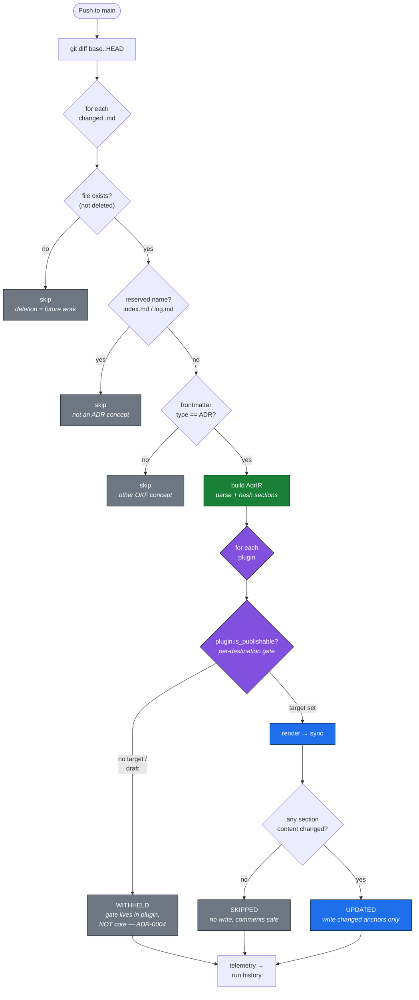
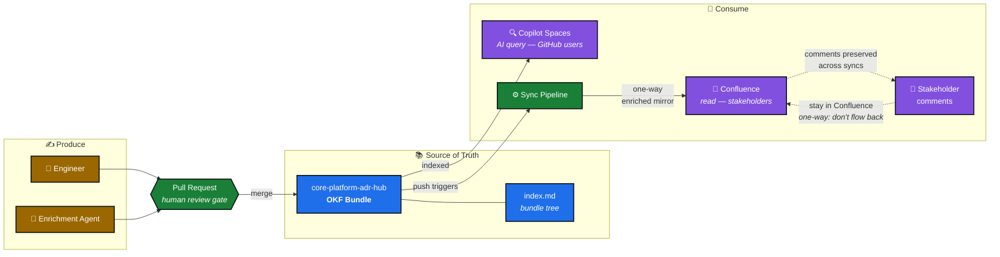

# Architecture Overview

Visual overview of the ABC Inc ADR knowledge system, from the widest
(C4 container) view down to the detailed component integrations and runtime
flows. Diagrams are standard Mermaid and render in GitHub, in Confluence (via a
Mermaid macro), and on static docs sites.

Traceability: the structures below implement the decisions recorded in
[ADR-0001](cross-boundary/ADR-CorePlatform-0001.md) (three-layer model),
[ADR-0002](cross-boundary/ADR-CorePlatform-0002.md) (hub repo),
[ADR-0003](cross-boundary/ADR-CorePlatform-0003.md) (sync pipeline), and
[ADR-0004](cross-boundary/ADR-CorePlatform-0004.md) (plugin architecture).

---

## 1. C4 Container Overview

The whole system: producers author into the OKF bundle (the source of truth),
which feeds both the Copilot Spaces query layer and the sync pipeline. The
pipeline mirrors to Confluence for non-GitHub stakeholders. The static docs site
is a future plugin (dashed).

---

## 2. C4 Component — Sync Pipeline Internals

Inside the pipeline: the core/plugin boundary from ADR-0004. Everything on the
core (green) side is destination-agnostic and produces the IR; plugins consume
the IR. Nothing destination-specific crosses back into core.

---

## 3. Sync Flow — Detection to Write

Per-ADR runtime interaction between core, the IR, and a plugin. Note the
`is_publishable` gate and the section hash-compare that yields either a
section-level write or a no-op that keeps Confluence comments safe.

---

## 4. Detection & Draft-Gate Flow

The decision tree for what gets synced. The OKF filters live in core; the draft
gate lives in the plugin (ADR-0004) — visually downstream of core.

---

## 5. End-to-End Knowledge Flow

Producers to consumers, with the one-way boundary made explicit: stakeholder
comments live in Confluence and deliberately do not flow back (a recorded
tradeoff of one-way sync).

